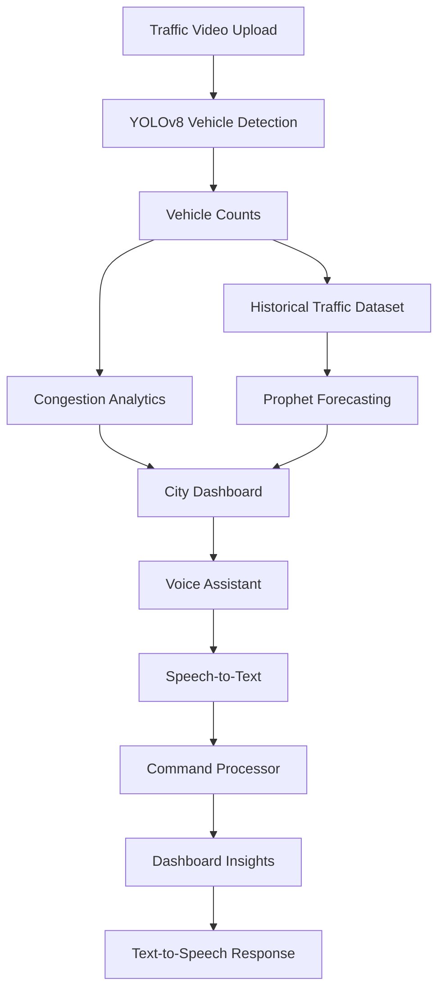
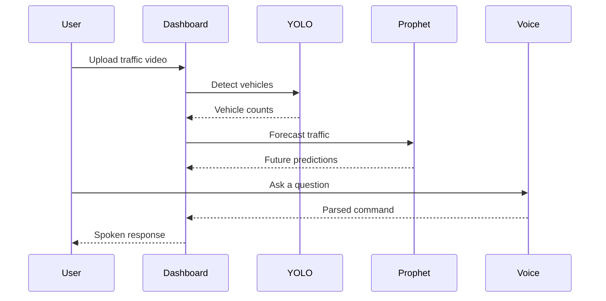

<div align="center">

# Smart Traffic Intelligence System

**AI-powered traffic analytics platform using computer vision, forecasting, and voice interaction.**


</div>

---

## 📖 Overview

The **Smart Traffic Intelligence System** is an advanced, production-ready AI application designed to transform raw traffic video feeds into actionable city-planning insights. By seamlessly combining state-of-the-art computer vision models, time-series forecasting, and an interactive voice assistant, this platform provides a comprehensive solution for monitoring, analyzing, and predicting urban traffic congestion.

Built for both local desktop environments and robust cloud deployments (including Hugging Face Spaces), it empowers decision-makers with real-time data, predictive trends, and hands-free conversational analytics.

---

## ✨ Key Features

- 🚗 **Real-time vehicle detection** using state-of-the-art YOLOv8 models
- 📊 **Video analytics dashboard** for comprehensive traffic flow visualization
- 🚦 **Congestion scoring** to intelligently classify current road conditions
- 📈 **Time-series forecasting** predicting future traffic peaks with Prophet
- 🎙️ **Voice assistant** with built-in browser speech recognition
- 🔊 **Browser-based text-to-speech** for conversational responses
- 📄 **PDF report generation** for sharing executive traffic summaries
- 🐳 **Docker deployment** for robust, containerized distribution
- 🤗 **Hugging Face compatibility** for immediate cloud availability

---

## 🛠️ Technology Stack

| Layer | Technologies |
| --- | --- |
| **Frontend UI** | Streamlit |
| **AI Models (Computer Vision)** | YOLOv8 (Ultralytics), OpenCV |
| **Time-Series Forecasting** | Prophet |
| **Data Processing** | Pandas, NumPy |
| **Data Visualization** | Plotly |
| **Voice & Audio** | SpeechRecognition, gTTS, streamlit-mic-recorder, pyttsx3, PyAudio |
| **Infrastructure & Deployment** | Docker, Hugging Face Spaces |

---

## 🏗️ System Architecture



---

## 🔄 Application Workflow



---

## 📂 Project Structure

```text
smart-traffic-intelligence/
├── app/
├── assets/
├── configs/
├── data/
├── notebooks/
├── scripts/
├── src/
│   ├── analytics/
│   ├── assistant/
│   ├── detection/
│   ├── forecasting/
│   └── common/
├── requirements.txt
├── Dockerfile
├── packages.txt
└── README.md
```

---

## 💻 Local Setup

```bash
git clone <repository-url>
cd smart-traffic-intelligence

python -m venv .venv
source .venv/bin/activate
# Windows:
# .venv\Scripts\activate

pip install -r requirements.txt

streamlit run app/streamlit_app.py
```

---

## 🐳 Docker Deployment

```bash
docker build -t smart-traffic-intelligence .

docker run -p 7860:7860 smart-traffic-intelligence
```

---

## ☁️ Hugging Face Deployment

### Deployment Steps:
1. Create a Docker Space on Hugging Face.
2. Connect your GitHub repository.
3. Deploy automatically using the provided Dockerfile.

**Important Note on Voice Integration:**
- Browser microphone access works only when users grant permission.
- Local desktop TTS libraries such as `pyttsx3` are unavailable in cloud environments.
- In Hugging Face, the application automatically uses browser microphone + `gTTS`.
- Local mode safely keeps `SpeechRecognition` + `pyttsx3` support unchanged.

---

## 🚀 Future Enhancements

- Multi-camera support
- Live CCTV streaming
- Edge deployment
- Traffic signal optimization
- LLM-powered conversational analytics
- Mobile dashboard

---

## 🤝 Contributors

* Kodali Dheeraj

---

## 📄 License

This project is licensed under the MIT License.
